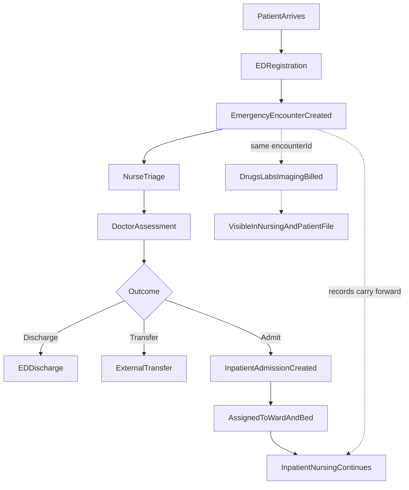
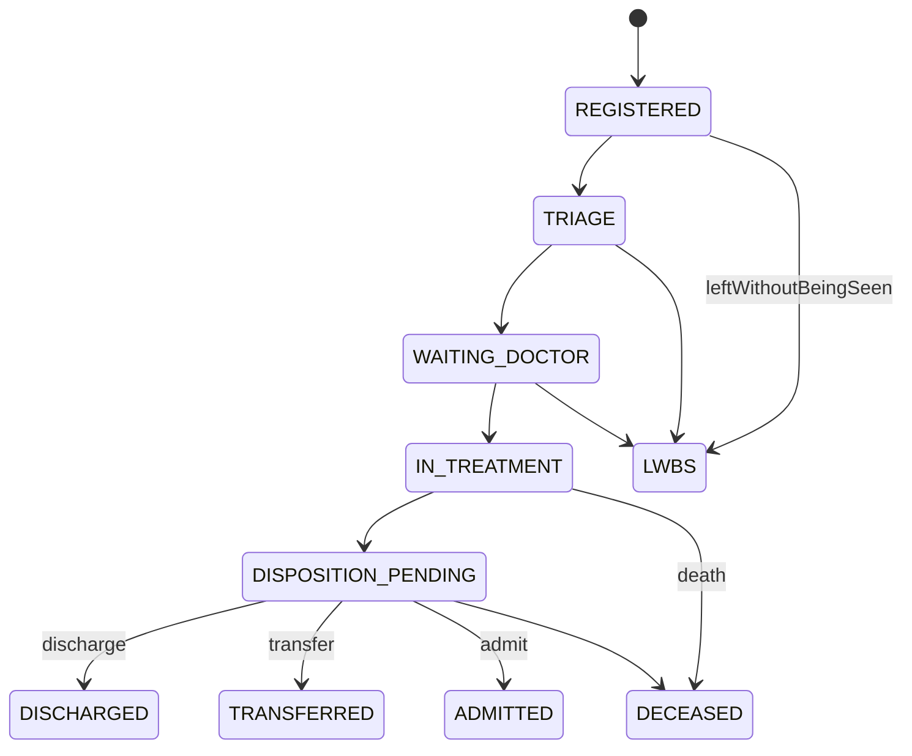
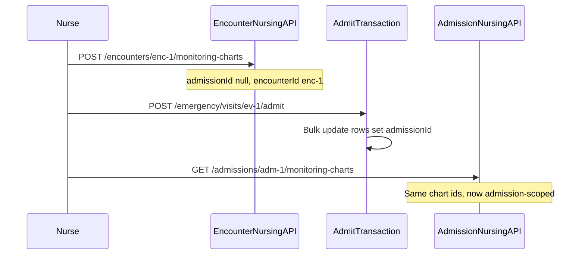

# Emergency Department & Inpatient Admission — frontend integration guide

This document describes the end-to-end **ED → Discharge / Transfer / Admit** workflow for frontend integration: screens, API routes, data models, roles, statuses, validation, audit, notifications, and reports.

All routes are relative to your configured API base URL.  
Auth: `Authorization: Bearer <token>` unless marked `@Public`.

**Legend for endpoint availability:**

| Tag | Meaning |
|-----|---------|
| **EXISTS** | Available in the backend today |
| **PROPOSED** | Designed but not yet implemented — UI should be built against these contracts; backend will follow in a later phase |

Related docs: [encounter-edit-history-frontend.md](./encounter-edit-history-frontend.md)

---

## Overview

### Workflow



### Core design principle

One **`Encounter`** with `encounterType: EMERGENCY` is the clinical and billing anchor for the entire ED visit. When the patient is admitted, the same encounter links to **`Admission`** (1:1 via `Encounter.admissionId`). Nursing documentation created during ED is **not duplicated** — on admit, records are re-anchored from `encounterId` to `admissionId`.

### What exists today vs planned

| Capability | Status |
|------------|--------|
| Generic emergency encounter create | **EXISTS** — `POST /encounters` with `encounterType: EMERGENCY` |
| ED specialty forms (`em.triage`, `em.disposition`) | **EXISTS** — clinical specialty APIs |
| Manual admission from encounter | **EXISTS** — `POST /admissions` |
| Inpatient nursing (admission-scoped) | **EXISTS** — `admissions/:admissionId/...` |
| Encounter billing (drugs, labs, imaging) | **EXISTS** — via `Invoice.encounterId` |
| ED queue / `EmergencyVisit` wrapper | **PROPOSED** |
| Encounter-scoped nursing (pre-admit ED) | **PROPOSED** |
| Unified clinical file + billing aggregate | **PROPOSED** — `GET /encounters/:id/clinical-file` |
| ED disposition / admit orchestration | **PROPOSED** |

Until **PROPOSED** endpoints ship, a minimal ED flow can use **EXISTS** endpoints manually: `POST /encounters` → triage/vitals → doctor workspace → `POST /admissions`.

---

## Role matrix

Map UI labels to backend `@AccountTypes` tokens (see `AccessGuard` in the backend).

| UI label | Backend token / `AccountType` | Typical ED screens |
|----------|------------------------------|-------------------|
| Receptionist | `FRONTDESK` / `FRONT_DESK` | Registration, LWBS, discharge paperwork |
| Nurse | `NURSE`, `HEAD_NURSE` | Triage, vitals, ED nursing charts, MAR |
| Doctor | `INPATIENT_DOCTOR`, `CONSULTANT`, `ONG` | Assessment, orders, disposition |
| Administrator | `SUPER_ADMIN`, `CMD` | ED board config, reports |
| Billing clerk | `BILLS` / `BILLING` | Invoice view, coverage |
| Medical records | `MEDICAL_RECORDS` | Patient file, demographics correction |
| Pharmacy / Lab / Radiology | `PHARMACY`, `LABORATORY`, `RADIOLOGY` | Order fulfillment (existing modules) |

**Clinical edit rule (EXISTS):** only the treating doctor (`encounter.doctorId === JWT sub`) may edit encounter clinical data. See [encounter-edit-history-frontend.md](./encounter-edit-history-frontend.md).

**Nursing write rule (EXISTS):** mutating inpatient nursing endpoints require `NURSE` or `HEAD_NURSE` (super-admin bypass).

---

## Data model reference

### Existing entities (EXISTS)

| Entity | Purpose | Key fields |
|--------|---------|------------|
| `Patient` | Demographics, current ward/status | `status`: `OUTPATIENT`, `ADMITED`, `DECEASED` |
| `Encounter` | Clinical + billing anchor | `encounterType`, `status`, `admissionId`, SOAP, `triageNotes` |
| `Admission` | Inpatient stay | `wardId`, `bedId`, `status`, `admissionType`, `encounter` (reverse) |
| `Ward` / `Bed` | Bed management | `Bed.status`: `AVAILABLE`, `OCCUPIED`, `CLEANING`, `RESERVED` |
| `Invoice` / `InvoiceItem` | Billing | `Invoice.encounterId`; items link to orders |
| `PatientVitals` | Vitals | `encounterId` (ED), `admissionId`, `waitingPatientId`, `invoiceId`, `patientId` |
| `EncounterClinicalSection` | Structured forms | e.g. `EMERGENCY_MEDICINE` + `em.triage` |

### Proposed: `EmergencyVisit` (PROPOSED)

ED-specific queue and disposition wrapper — one row per ED visit, linked 1:1 to `Encounter`.

| Field | Type | Notes |
|-------|------|-------|
| `id` | UUID | PK |
| `encounterId` | UUID | `@unique` → `Encounter` |
| `patientId` | UUID | Denormalized for queue queries |
| `arrivalMode` | enum | `WALK_IN`, `AMBULANCE`, `POLICE`, `REFERRAL` |
| `arrivalAt` | DateTime | Registration time |
| `registeredById` | UUID | Front desk staff |
| `triageNurseId` | UUID? | Assigned triage nurse |
| `assignedDoctorId` | UUID? | May differ from `encounter.doctorId` until assigned |
| `workflowStatus` | enum | See status machine below |
| `esiLevel` | Int? | 1–5 (Emergency Severity Index) |
| `triageCompletedAt` | DateTime? | |
| `disposition` | enum? | See disposition enum |
| `dispositionAt` | DateTime? | |
| `dispositionNotes` | String? | |
| `transferDestination` | String? | External facility |
| `admissionId` | UUID? | Set when admitted |
| `createdAt` / `updatedAt` | DateTime | |

### Proposed enums (PROPOSED)

**`EdWorkflowStatus`** (non-terminal → terminal):

```
REGISTERED → TRIAGE → WAITING_DOCTOR → IN_TREATMENT → DISPOSITION_PENDING
  → DISCHARGED | TRANSFERRED | ADMITTED | LWBS | DECEASED | CANCELLED
```

**`EdArrivalMode`:** `WALK_IN`, `AMBULANCE`, `POLICE`, `REFERRAL`

**`EdDisposition`:** `DISCHARGE_HOME`, `DISCHARGE_AMA`, `ADMIT_WARD`, `ADMIT_ICU`, `TRANSFER_EXTERNAL`, `OBSERVATION`, `LWBS`, `DECEASED`

**Existing enums reused:**

| Enum | Values (ED-relevant) |
|------|---------------------|
| `EncounterType` | `EMERGENCY` |
| `EncounterStatus` | `ONGOING`, `COMPLETED`, `CANCELLED` |
| `AdmissionType` | `EMERGENCY`, `ELECTIVE`, `TRANSFER` |
| `AdmissionStatus` | `ACTIVE`, `DISCHARGED`, `TRANSFERRED`, `DECEASED` |
| `PatientStatus` | `OUTPATIENT`, `ADMITED`, `DECEASED` |

### Proposed: nursing record continuity (PROPOSED)

Add optional `encounterId` to these models (migration):

- `MonitoringChart`, `NursingNote`, `MedicationAdministration`, `IntakeOutputRecord`
- `IVFluidOrder`, `IVMonitoring`, `ProcedureRecord`, `WoundAssessment`, `CarePlan`

(`PatientVitals.encounterId` is **EXISTS** — use `POST /patient-vitals` with `encounterId` for ED triage.)

**Constraint:** exactly one of `encounterId` or `admissionId` required at create time.

**On admit:** a single transaction sets `admissionId` on all rows where `encounterId = X` (records appear in existing admission-scoped lists without duplication).

#### Migration notes for backend team

1. Add nullable `encounterId` FK columns with indexes.
2. Backfill not required (greenfield ED feature).
3. Application validation: reject create if both or neither anchor is set.
4. Admit transaction order: create `Admission` → link `Encounter.admissionId` → bulk-update nursing rows → update `Bed.status` → set `EmergencyVisit.admissionId`.

---

## Status machines

### ED workflow status (PROPOSED — `EmergencyVisit.workflowStatus`)



### Encounter status mapping by outcome

| ED outcome | `Encounter.status` | `EmergencyVisit.workflowStatus` |
|------------|-------------------|--------------------------------|
| Discharge home / AMA | `COMPLETED` | `DISCHARGED` |
| Transfer external | `COMPLETED` | `TRANSFERRED` |
| Admit | `COMPLETED` on admission create (existing behavior) | `ADMITTED` |
| LWBS | `CANCELLED` | `LWBS` |
| Death | `COMPLETED` | `DECEASED` |

### Allowed transitions (validation rules)

| From | Allowed to |
|------|------------|
| `REGISTERED` | `TRIAGE`, `LWBS`, `CANCELLED` |
| `TRIAGE` | `WAITING_DOCTOR`, `IN_TREATMENT`, `LWBS` |
| `WAITING_DOCTOR` | `IN_TREATMENT`, `LWBS` |
| `IN_TREATMENT` | `DISPOSITION_PENDING` |
| `DISPOSITION_PENDING` | `DISCHARGED`, `TRANSFERRED`, `ADMITTED`, `DECEASED` |
| Terminal states | No further transitions |

Frontend should disable actions that violate these rules and surface `400` messages from the API.

---

## UI screens and API integration

### 1. ED Board

**Purpose:** Real-time queue of active ED visits sorted by ESI / wait time.

**Roles:** `FRONT_DESK`, `NURSE`, `HEAD_NURSE`, `INPATIENT_DOCTOR`, `CONSULTANT`

**Columns:** patient name, ESI, chief complaint, arrival time, wait duration, assigned doctor, `workflowStatus`, encounter id.

| Method | Route | Tag |
|--------|-------|-----|
| `GET` | `/emergency/visits?status=&esiLevel=&fromDate=&toDate=&skip=&take=` | **PROPOSED** |
| `GET` | `/emergency/visits/:id` | **PROPOSED** |

**Interim (EXISTS):** poll `GET /encounters?encounterType=EMERGENCY&status=ONGOING` with `fromDate`/`toDate` filters — no queue metadata until `EmergencyVisit` exists.

**Refresh strategy:** poll every 15–30s or WebSocket when available. ED board should refresh after registration, triage complete, disposition, and admit.

**Response shape (PROPOSED):**

```json
{
  "visits": [
    {
      "id": "ev-uuid",
      "encounterId": "enc-uuid",
      "patientId": "pat-uuid",
      "patientName": "Jane Doe",
      "chiefComplaint": "Chest pain",
      "arrivalAt": "2026-05-30T08:15:00.000Z",
      "arrivalMode": "WALK_IN",
      "workflowStatus": "WAITING_DOCTOR",
      "esiLevel": 2,
      "assignedDoctor": { "id": "doc-uuid", "firstName": "Ada", "lastName": "Okafor" },
      "waitMinutes": 42
    }
  ],
  "total": 12,
  "skip": 0,
  "take": 50
}
```

---

### 2. ED Registration

**Purpose:** Identify or register patient; open ED visit; place on ED board.

**Entities:** `Patient`, `EmergencyVisit` (PROPOSED), `Encounter`

**Roles:** `FRONT_DESK`, `NURSE`, `MEDICAL_RECORDS`

**Actions:**

1. Search patient — **EXISTS** `GET /patients?q=...`
2. Create patient if new — **EXISTS** `POST /patients`
3. Start ED visit — **PROPOSED** `POST /emergency/visits`

**Required fields:**

| Field | Required | Notes |
|-------|----------|-------|
| `patientId` | Yes | |
| `chiefComplaint` | Yes | Stored on encounter |
| `doctorId` | Yes | Treating / assigned doctor |
| `arrivalMode` | Yes (PROPOSED) | Default `WALK_IN` |
| `triageNurseId` | No | |
| `registrationFeeServiceId` | No | Optional ED registration invoice line |

**Validation:**

- Patient must exist.
- **PROPOSED:** reject if another active `EmergencyVisit` exists for same patient (non-terminal status).
- Doctor must be active staff with physician account type.
- Unlike OPD, **no paid consultation invoice required** for `EMERGENCY` encounters.

**Status after success:** `EmergencyVisit.workflowStatus = REGISTERED`, `Encounter.status = ONGOING`.

**Audit:** `Encounter.createdById`, `EmergencyVisit.registeredById` (PROPOSED).

**Notifications:** ED board refresh; **PROPOSED** SMS to on-call for ESI 1 (future).

**Reports:** daily ED arrivals by `arrivalMode`, hour, cadre.

#### `POST /emergency/visits` (PROPOSED)

Creates atomically: `Encounter` (`EMERGENCY`, `ONGOING`) + `EmergencyVisit` + optional registration fee on invoice.

```json
{
  "patientId": "pat-uuid",
  "doctorId": "doc-uuid",
  "chiefComplaint": "Shortness of breath",
  "arrivalMode": "AMBULANCE",
  "triageNurseId": "nurse-uuid",
  "hpi": "Optional initial HPI"
}
```

**Response `201`:**

```json
{
  "emergencyVisit": { "id": "ev-uuid", "workflowStatus": "REGISTERED", "encounterId": "enc-uuid" },
  "encounter": { "id": "enc-uuid", "encounterType": "EMERGENCY", "status": "ONGOING" }
}
```

#### Interim: `POST /encounters` (EXISTS)

```json
{
  "patientId": "pat-uuid",
  "doctorId": "doc-uuid",
  "encounterType": "EMERGENCY",
  "chiefComplaint": "Shortness of breath",
  "triageNotes": "Arrived by ambulance"
}
```

Returns `200` if an ongoing `EMERGENCY` encounter already exists for the patient (reuse), else `201`.

---

### 3. Nurse Triage

**Purpose:** Rapid assessment, vitals, ESI, priority on ED board.

**Entities:** `PatientVitals`, `EncounterClinicalSection` (`em.triage`), `EmergencyVisit`

**Roles:** `NURSE`, `HEAD_NURSE`

**Required fields:**

| Field | Source |
|-------|--------|
| Vitals (BP, pulse, temp, SpO2, pain) | `PatientVitals` |
| `esiLevel` (1–5) | `EmergencyVisit` + `em.triage` section |
| `abcs` primary survey | `em.triage` JSON |
| `interventions` | `em.triage` JSON |

**Actions:** record vitals; enable `EMERGENCY_MEDICINE` module; upsert `em.triage`; mark triage complete.

**Status transition:** `TRIAGE` → `WAITING_DOCTOR` (or `IN_TREATMENT` if doctor already assigned).

**Validation:**

- ESI must be 1–5.
- Vitals ranges: systolic/diastolic ≥ 0; SpO2 0–100; pain 0–10.
- **PROPOSED:** cannot complete triage without `esiLevel`.

**Audit:** `PatientVitals.recordedByNurseId`; encounter edit history if encounter already completed (see edit history doc).

**Notifications:** **PROPOSED** ESI 1–2 → alert assigned doctor + charge nurse.

**Reports:** triage time (arrival → `triageCompletedAt`), ESI distribution.

#### Enable ED specialty module (EXISTS)

**PUT** `/encounters/:id/specialty-modules`

```json
{
  "modules": [
    {
      "specialty": "EMERGENCY_MEDICINE",
      "enabledSectionKeys": ["em.triage", "em.disposition"]
    }
  ]
}
```

Requires `@AccountTypes`: `ONG`, `CONSULTANT`, `INPATIENT_DOCTOR`, etc. Nurses can **read** sections; doctors **write** section payloads.

#### Upsert triage section (EXISTS)

**PUT** `/encounters/:id/clinical-sections/EMERGENCY_MEDICINE/em.triage`

```json
{
  "data": {
    "esiLevel": 2,
    "abcs": "Airway patent, breathing tachypnoeic, circulation stable",
    "interventions": "O2 via nasal cannula"
  }
}
```

Catalog example data lives in backend `clinical-specialty-catalog.ts`.

#### Record vitals (EXISTS)

**POST** `/patient-vitals`

Provide **exactly one** anchor: `encounterId` (ED triage), `waitingPatientId` (OPD queue), `admissionId` (inpatient), or `invoiceId` (paid OPD). Sending only `patientId` returns `400`.

**ED triage** — use the emergency encounter id from registration:

```json
{
  "encounterId": "enc-uuid-from-ed-registration",
  "patientId": "pat-uuid",
  "systolic": 140,
  "diastolic": 90,
  "pulseRate": 98,
  "temperature": 37.2,
  "spo2": 94,
  "painScore": 6,
  "notes": "Triage vitals"
}
```

List vitals for an encounter: **GET** `/patient-vitals?encounterId=enc-uuid`

#### Update ED visit status (PROPOSED)

**PATCH** `/emergency/visits/:id`

```json
{
  "workflowStatus": "WAITING_DOCTOR",
  "esiLevel": 2,
  "triageCompletedAt": "2026-05-30T08:25:00.000Z"
}
```

---

### 4. Doctor ED Workspace

**Purpose:** Full clinical evaluation, diagnoses, orders, procedures.

**Entities:** `Encounter`, `EncounterDiagnosis`, `MedicationOrder`, `LabRequest`, `RadiologyOrder`, `Invoice`

**Roles:** `INPATIENT_DOCTOR`, `CONSULTANT`, `RESIDENT` — treating doctor for edits

**Required before disposition:** at least one working diagnosis (enforce in UI; **PROPOSED** server validation on disposition).

**Status:** `IN_TREATMENT` (may remain while orders pending).

**Actions:**

| Action | Route | Tag |
|--------|-------|-----|
| Load encounter | `GET /encounters/:id?expand=*` | **EXISTS** |
| Update SOAP / HPI | `PATCH /encounters/:id` | **EXISTS** |
| Add diagnosis | `POST /encounters/:encounterId/diagnoses` | **EXISTS** |
| Medication orders | `/medication-orders` (encounter-scoped) | **EXISTS** |
| Lab requests | `/lab-requests` | **EXISTS** |
| Radiology | `/radiology/requests` | **EXISTS** |
| Procedures | `PATCH /encounters/:id` with `proceduresJson` | **EXISTS** |

**Billing:** orders auto-create or attach to `Invoice` for the encounter. Inpatient credit applies once patient has active admission (`assertInpatientCreditAllowed`). Pre-admit ED: bill to encounter invoice; payment rules follow existing invoice module.

**Audit:** `EncounterEditHistory` on post-completion edits; `InvoiceAuditLog` on billable line changes.

**Notifications:** urgent/emergency lab and radiology priority → respective department dashboards (existing radiology priority enum includes `EMERGENCY`).

**Reports:** ED length of stay, orders per encounter.

#### Encounter detail expand (EXISTS)

**GET** `/encounters/:id?expand=medicationOrders,labRequests,radiologyOrders,specialtyModules,clinicalSections,invoices`

Use `editMeta` from response for amendment UI — see [encounter-edit-history-frontend.md](./encounter-edit-history-frontend.md).

#### Assign / change doctor (PROPOSED)

**PATCH** `/emergency/visits/:id` with `{ "assignedDoctorId": "..." }` and sync `Encounter.doctorId` if treating doctor changes.

---

### 5. Disposition (Discharge / Transfer / Admit decision)

**Purpose:** Close ED visit with structured outcome.

**Roles:** `INPATIENT_DOCTOR`, `CONSULTANT` (decision); `FRONT_DESK` (paperwork); `NURSE` (exit vitals)

**Required fields by outcome:**

| Outcome | Required |
|---------|----------|
| Discharge | `disposition` (`DISCHARGE_HOME` or `DISCHARGE_AMA`), `dispositionNotes`, discharge instructions |
| Transfer | `disposition` = `TRANSFER_EXTERNAL`, `transferDestination`, summary |
| Admit | `disposition` = `ADMIT_WARD` or `ADMIT_ICU`, then admit wizard (ward/bed) |
| LWBS | `disposition` = `LWBS` |
| Death | `disposition` = `DECEASED`, `outcome` documentation |

**Actions:** open disposition modal with three tabs (Discharge / Transfer / Admit); persist `em.disposition` section; submit disposition endpoint.

**Audit:** upsert `EncounterClinicalSection` key `em.disposition`; complete encounter where applicable.

**Validation:**

- **PROPOSED:** block discharge if critical pending results (configurable flag).
- Admit path: bed must be `AVAILABLE`.
- Cannot disposition if visit already terminal.

**Notifications:** admit → ward nurse + bed manager (**PROPOSED**); transfer → external notification (**PROPOSED** future).

**Reports:** disposition mix, LWBS rate, admission conversion rate.

#### Upsert disposition section (EXISTS)

**PUT** `/encounters/:id/clinical-sections/EMERGENCY_MEDICINE/em.disposition`

```json
{
  "data": {
    "disposition": "DISCHARGE_HOME",
    "followUp": "GP review in 48 hours"
  }
}
```

#### Submit disposition (PROPOSED)

**POST** `/emergency/visits/:id/disposition`

**Discharge example:**

```json
{
  "disposition": "DISCHARGE_HOME",
  "dispositionNotes": "Stable for discharge",
  "dischargeSummary": "Acute bronchitis, improved on nebulizer",
  "followUpInstructions": "Return if worsening breathlessness"
}
```

**Transfer example:**

```json
{
  "disposition": "TRANSFER_EXTERNAL",
  "transferDestination": "Regional Trauma Centre",
  "dispositionNotes": "Needs neurosurgical review"
}
```

**Admit example** (first step — opens admit wizard):

```json
{
  "disposition": "ADMIT_WARD",
  "dispositionNotes": "Admission for observation and IV antibiotics"
}
```

Server sets `workflowStatus = DISPOSITION_PENDING` then client opens admit wizard, or combined admit endpoint below.

**Interim discharge (EXISTS):** `PATCH /encounters/:id/complete` after documenting disposition in `em.disposition` section.

---

### 6. Admit Wizard

**Purpose:** Assign ward and bed; create admission; bridge ED nursing → inpatient nursing.

**Entities:** `Admission`, `Ward`, `Bed`, `NurseAssignment`, `Encounter.admissionId`

**Roles:** `INPATIENT_DOCTOR` (order), `NURSE` / `HEAD_NURSE` (bed assignment), `BILLS` (coverage check)

**Required fields:**

| Field | Notes |
|-------|-------|
| `patientId` | From encounter |
| `encounterId` | ED encounter |
| `wardId` | Target ward |
| `bedId` | Must be `AVAILABLE` (**PROPOSED** enforced) |
| `attendingDoctorId` | |
| `admissionType` | `EMERGENCY` (**PROPOSED** auto-set) |
| `primaryDiagnosis` | From encounter ICD (**PROPOSED** auto-filled) |
| `admissionReason` | Chief complaint / disposition notes |

**Post-admit server actions (PROPOSED transaction):**

1. Create `Admission` with `admissionType: EMERGENCY`
2. Set `Encounter.admissionId`, `Encounter.status = COMPLETED`
3. Set `Patient.status = ADMITED`, `Patient.wardId`
4. Re-anchor all nursing rows: `encounterId` → `admissionId`
5. Set `Bed.status = OCCUPIED`
6. Set `EmergencyVisit.admissionId`, `workflowStatus = ADMITTED`
7. Create default `NurseAssignment`

**Status:** `Admission.status = ACTIVE`

**Audit:** `Admission.createdById`; **PROPOSED** `AuditTrail` rows (model exists, writes not yet implemented).

**Notifications:** ward dashboard new admission (**PROPOSED**); pharmacy if active med orders.

**Reports:** ED-to-ward time, bed occupancy, emergency admissions by ward.

#### Ward / bed picker (EXISTS)

| Method | Route |
|--------|-------|
| `GET` | `/wards` — list wards with beds |
| `GET` | `/wards/:id` — ward detail + active inpatients |
| `GET` | `/wards/:wardId/beds` — beds with `status` |

Filter UI to `Bed.status === 'AVAILABLE'` for selection.

#### `POST /emergency/visits/:id/admit` (PROPOSED)

```json
{
  "wardId": "ward-uuid",
  "bedId": "bed-uuid",
  "attendingDoctorId": "doc-uuid",
  "reason": "Sepsis workup",
  "primaryNurseId": "nurse-uuid"
}
```

**Response `201`:**

```json
{
  "admission": {
    "id": "adm-uuid",
    "status": "ACTIVE",
    "admissionType": "EMERGENCY",
    "wardId": "ward-uuid",
    "bedId": "bed-uuid",
    "encounter": { "id": "enc-uuid", "status": "COMPLETED" }
  },
  "emergencyVisit": { "id": "ev-uuid", "workflowStatus": "ADMITTED" }
}
```

#### Interim: `POST /admissions` (EXISTS)

```json
{
  "patientId": "pat-uuid",
  "encounterId": "enc-uuid",
  "wardId": "ward-uuid",
  "bedId": "bed-uuid",
  "attendingDoctorId": "doc-uuid",
  "reason": "Admitted from ED"
}
```

**Note:** today this does **not** set `admissionType`, update `Bed.status`, or re-anchor encounter-scoped nursing records.

---

### 7. Nursing Area (ED + Inpatient)

**Purpose:** Clinical nursing documentation and visibility of orders/billing.

**Dual routing:**

| Phase | Base path | Tag |
|-------|-----------|-----|
| Pre-admit ED | `encounters/:encounterId/...` | **PROPOSED** |
| Post-admit | `admissions/:admissionId/...` | **EXISTS** |

Use the same DTOs for both paths. After admit, switch UI base path to `admissionId`; historical ED records appear in the same lists (re-anchored, not copied).

#### Existing inpatient nursing routes (EXISTS)

All under `admissions/:admissionId/`:

| Resource | Routes |
|----------|--------|
| Monitoring charts | `GET/POST /monitoring-charts`, `PATCH /monitoring-charts/:chartId` |
| Nursing notes | `GET/POST /nursing-notes`, `PATCH /nursing-notes/:noteId` |
| Medication administrations (MAR) | `GET/POST /medication-administrations`, `PATCH .../:id` |
| Medication orders | `GET/POST /medication-orders` |
| IV fluids | `GET/POST /iv-fluid-orders` |
| IV monitoring | `GET/POST /iv-monitoring` |
| Intake/output | `GET/POST /intake-output-records` |
| Procedure records | `GET/POST /procedure-records` |
| Wound assessments | `GET/POST /wound-assessments` |
| Care plans | `GET/POST /care-plans` |
| Handover reports | `GET/POST /handover-reports` |
| Nurse assignments | `GET/POST /nurse-assignments` |
| Alert log | `GET/POST /alert-logs` |

**Account types:** read often includes `INPATIENT_DOCTOR`, `CONSULTANT`; write requires `NURSE`, `HEAD_NURSE`.

#### Proposed encounter-scoped mirrors (PROPOSED)

Same resource names, prefixed with `encounters/:encounterId/`:

```
GET/POST  /encounters/:encounterId/monitoring-charts
GET/POST  /encounters/:encounterId/nursing-notes
GET/POST  /encounters/:encounterId/medication-administrations
... (same pattern for all nursing resources above)
```

**UI routing logic:**

```typescript
const nursingBase =
  admissionId != null
    ? `/admissions/${admissionId}`
    : `/encounters/${encounterId}`;
```

#### Clinical continuity on admit



Frontend should **not** re-fetch from encounter routes after admit — switch to admission routes using `admissionId` from admit response.

---

### 8. Billing panel in nursing & patient file

**Purpose:** Show drugs, labs, imaging, and procedures billed to the patient for this encounter — same data billing desk sees.

**Billing chain (EXISTS):**

```
Invoice.encounterId → Encounter → (optional) Admission
InvoiceItem → MedicationOrder | LabRequest | LabOrder | RadiologyOrderItem | Service
```

**No `Invoice.admissionId`** — always resolve via encounter.

#### `GET /encounters/:id/clinical-file` (PROPOSED)

Single aggregate for nursing sidebar and patient file tab.

```json
{
  "encounter": {
    "id": "enc-uuid",
    "encounterType": "EMERGENCY",
    "status": "ONGOING",
    "chiefComplaint": "Chest pain",
    "soapSubjective": "...",
    "admissionId": null
  },
  "emergencyVisit": {
    "workflowStatus": "IN_TREATMENT",
    "esiLevel": 2
  },
  "clinicalSections": [
    { "specialty": "EMERGENCY_MEDICINE", "sectionKey": "em.triage", "data": {} }
  ],
  "diagnoses": [],
  "nursing": {
    "monitoringCharts": [],
    "nursingNotes": [],
    "vitals": [],
    "medicationAdministrations": []
  },
  "orders": {
    "medicationOrders": [],
    "labRequests": [],
    "radiologyOrders": []
  },
  "billing": {
    "invoices": [
      {
        "id": "inv-uuid",
        "status": "PARTIALLY_PAID",
        "totalAmount": "45000.00",
        "amountPaid": "20000.00",
        "amountDue": "25000.00",
        "items": [
          {
            "id": "item-uuid",
            "description": "CBC",
            "quantity": 1,
            "unitPrice": "5000.00",
            "settled": false,
            "linkedOrderType": "LabRequest",
            "linkedOrderId": "lab-req-uuid"
          }
        ]
      }
    ],
    "summary": {
      "totalBilled": "45000.00",
      "totalPaid": "20000.00",
      "totalDue": "25000.00"
    }
  },
  "admission": null
}
```

When admitted, `admission` is populated and `nursing.*` includes both pre-admit (re-anchored) and post-admit records.

#### Interim billing load (EXISTS)

Until `clinical-file` exists, compose from:

| Data | Route |
|------|-------|
| Encounter + orders | `GET /encounters/:id?expand=medicationOrders,labRequests,radiologyOrders,invoices` |
| Invoice detail | `GET /invoices/:id` |
| Patient invoices | `GET /patients/:id` (includes `invoice` relation) |

#### Nursing UI billing sidebar

Recommended layout:

| Column | Source |
|--------|--------|
| Service / drug name | `InvoiceItem` description or linked order |
| Qty × price | `quantity`, `unitPrice` |
| Status | `settled` → Paid / Pending |
| Order status | Linked lab/radiology/med order status |
| Running total | `billing.summary` |

Read-only for nurses; link to billing module for `BILLS` role if payment actions needed.

---

### 9. Patient File tab

**Purpose:** Longitudinal view of patient encounters, admissions, and clinical + billing data.

**Roles:** `MEDICAL_RECORDS`, `INPATIENT_DOCTOR`, `CONSULTANT`, `NURSE`, `BILLS`

#### Timeline (EXISTS + PROPOSED filter)

| Method | Route | Tag |
|--------|-------|-----|
| `GET` | `/encounters/patient/:patientId` | **EXISTS** |
| `GET` | `/encounters/patient/:patientId?encounterType=EMERGENCY` | **EXISTS** (via query on `GET /encounters`) |
| `GET` | `/admissions/patient/:patientId` | **EXISTS** |
| `GET` | `/patients/:id` | **EXISTS** — demographics, invoices, reports |

**PROPOSED:** `GET /patients/:id/encounters?type=EMERGENCY&fromDate=&toDate=` as dedicated timeline endpoint.

#### Expandable row

On row expand → `GET /encounters/:id/clinical-file` (**PROPOSED**) or composed EXISTS calls.

Show:

- ED workflow status + ESI
- SOAP summary
- Orders + results status
- Invoice summary (`amountDue` badge if unpaid)
- Link to full nursing chart (admission routes if admitted)

---

## Audit trail requirements

| Domain | Mechanism | Status |
|--------|-----------|--------|
| Encounter clinical edits (post-complete) | `EncounterEditHistory` snapshot | **EXISTS** |
| Invoice / payments | `InvoiceAuditLog` | **EXISTS** |
| Admission / nursing MAR | `AuditTrail` on `Admission` | Schema **EXISTS**, writes **PROPOSED** |
| ED visit status changes | `EmergencyVisit` + audit log table or JSON log | **PROPOSED** |
| Vitals | `recordedByNurseId` | **EXISTS** |
| Disposition | `EncounterClinicalSection` `em.disposition` + `dispositionAt` | Section **EXISTS**, timestamp **PROPOSED** on `EmergencyVisit` |

**UI recommendations:**

- Show **Edited** badge on amended encounters (`editMeta.hasEdits`).
- Show **Amended invoice** from invoice audit when billing clerk views history.
- ED board: display `dispositionAt` and user who dispositioned (**PROPOSED** field `dispositionById`).

---

## Validation rules summary

| Rule | Stage | Enforcement |
|------|-------|-------------|
| Patient exists | Registration | **EXISTS** |
| Exactly one vitals anchor (`encounterId`, etc.) | Triage | **EXISTS** |
| No duplicate active ED visit | Registration | **PROPOSED** |
| ESI 1–5 | Triage | **PROPOSED** |
| Triage complete requires ESI | Triage | **PROPOSED** |
| Treating doctor for encounter edits | Assessment | **EXISTS** |
| Diagnosis before disposition | Disposition | **PROPOSED** (UI + server) |
| Bed available for admit | Admit | **PROPOSED** |
| Encounter not already linked to admission | Admit | **EXISTS** |
| Unpaid invoices block discharge (not admit) | IP discharge | **EXISTS** |
| `encounterId` XOR `admissionId` on nursing create | ED nursing | **PROPOSED** |
| Valid workflow status transitions | All ED stages | **PROPOSED** |
| Service category for billable items | Orders | **EXISTS** |

Standard error body: `{ "statusCode": number, "message": string | string[] }`.

---

## Notifications

| Event | Channel | Status |
|-------|---------|--------|
| ED board update | Poll / WebSocket | UI poll **now**; push **PROPOSED** |
| Doctor assigned to ED case | In-app | **PROPOSED** (follow appointment notification pattern) |
| ESI 1–2 triage | SMS / in-app to doctor + charge nurse | **PROPOSED** |
| Urgent lab / EMERGENCY radiology | Department dashboard | **EXISTS** (radiology priority) |
| Admit to ward | Ward nurse dashboard | **PROPOSED** |
| Critical vitals | `AlertLog` | **EXISTS** on admission |
| Appointment reminders | Email/SMS | **EXISTS** — not ED-specific |

---

## Reports (data sources for analytics UI)

| Report | Primary entities | Status |
|--------|------------------|--------|
| Daily ED arrivals | `EmergencyVisit.arrivalAt`, `arrivalMode` | **PROPOSED** |
| ED wait times | `arrivalAt`, `triageCompletedAt`, first doctor contact | **PROPOSED** |
| ESI distribution | `esiLevel` | **PROPOSED** |
| Disposition mix | `EdDisposition` | **PROPOSED** |
| LWBS rate | `workflowStatus = LWBS` | **PROPOSED** |
| ED → admission conversion | `ADMITTED` / total dispositions | **PROPOSED** |
| ED length of stay | `arrivalAt`, `dispositionAt` | **PROPOSED** |
| Bed occupancy | `Bed.status`, `Admission` | Partial **EXISTS** via wards API |
| Combined ED + IP LOS | Encounter + admission dates | **PROPOSED** |
| Revenue by ED encounter | `Invoice` via `encounterId` | **EXISTS** |
| CMD triage dashboard | `cmd-analytics` | Stub **EXISTS** (hardcoded 0) |

---

## Endpoint reference

### PROPOSED — Emergency module

| Method | Route | Description |
|--------|-------|-------------|
| `POST` | `/emergency/visits` | Register ED visit + encounter |
| `GET` | `/emergency/visits` | ED board / queue list |
| `GET` | `/emergency/visits/:id` | Visit detail with encounter summary |
| `PATCH` | `/emergency/visits/:id` | Update status, ESI, assignments |
| `POST` | `/emergency/visits/:id/disposition` | Discharge / transfer / LWBS / death |
| `POST` | `/emergency/visits/:id/admit` | Admit orchestration |
| `GET` | `/encounters/:id/clinical-file` | Unified clinical + billing aggregate |
| `GET` | `/patients/:id/encounters` | Patient timeline with filters |

### PROPOSED — Encounter-scoped nursing

Mirror each `admissions/:admissionId/<resource>` route under `encounters/:encounterId/<resource>` (same DTOs, same response shapes).

### EXISTS — Core routes used in ED flow

| Method | Route | Use |
|--------|-------|-----|
| `POST` | `/encounters` | Create EMERGENCY encounter (interim registration) |
| `GET` | `/encounters/:id` | Doctor workspace |
| `PATCH` | `/encounters/:id` | Update clinical fields |
| `PATCH` | `/encounters/:id/complete` | Complete encounter (interim discharge) |
| `GET` | `/encounters/patient/:patientId` | Patient encounter list |
| `PUT` | `/encounters/:id/specialty-modules` | Enable EMERGENCY_MEDICINE |
| `PUT` | `/encounters/:id/clinical-sections/EMERGENCY_MEDICINE/em.triage` | Triage form |
| `PUT` | `/encounters/:id/clinical-sections/EMERGENCY_MEDICINE/em.disposition` | Disposition form |
| `POST` | `/patient-vitals` | Triage vitals |
| `POST` | `/admissions` | Create admission (interim admit) |
| `GET` | `/admissions/:id` | Full inpatient chart bundle |
| `GET` | `/wards`, `/wards/:wardId/beds` | Bed picker |
| `GET` | `/patients/:id` | Patient file header |

---

## Example end-to-end flows

### Flow A — Full ED path (when PROPOSED APIs available)

1. **Register** — `POST /emergency/visits` → navigate to triage with `encounterId`, `emergencyVisitId`.
2. **Triage** — enable specialty module → vitals → `PUT em.triage` → `PATCH /emergency/visits/:id` (`WAITING_DOCTOR`).
3. **Doctor** — `GET /encounters/:id?expand=*` → SOAP, orders → billing accrues on encounter invoice.
4. **ED nursing** — `POST /encounters/:encounterId/nursing-notes` (PROPOSED).
5. **Disposition** — `POST /emergency/visits/:id/disposition` with `ADMIT_WARD`.
6. **Admit** — pick bed → `POST /emergency/visits/:id/admit` → receive `admissionId`.
7. **Inpatient** — switch to `/admissions/:admissionId/...` routes; billing sidebar from `GET /encounters/:id/clinical-file`.

### Flow B — Interim (EXISTS APIs only)

1. `POST /encounters` with `encounterType: EMERGENCY`.
2. Triage via vitals + clinical sections (no ED board).
3. Doctor workspace on encounter; orders bill to encounter invoice.
4. `POST /admissions` with `encounterId`, `wardId`, `bedId`.
5. Inpatient nursing on `admissions/:admissionId/...`; billing via `GET /encounters/:id?expand=invoices`.

### Flow C — ED discharge without admission

1. Complete clinical documentation and `em.disposition`.
2. **PROPOSED:** `POST /emergency/visits/:id/disposition` with `DISCHARGE_HOME`.
3. **Interim:** `PATCH /encounters/:id/complete`.
4. Patient remains `OUTPATIENT`; invoice may still have balance due.

---

## Error handling

| HTTP | When |
|------|------|
| `400 Bad Request` | Invalid status transition; missing disposition fields; bed not available; validation errors |
| `403 Forbidden` | Wrong role; non-treating doctor editing encounter |
| `404 Not Found` | Unknown patient, encounter, visit, ward, or bed |
| `409 Conflict` | Active ED visit already exists; encounter already linked to admission |

---

## Appendix A — Backend implementation phases

For backend team scheduling; not required for frontend mockups if PROPOSED contracts above are followed.

| Phase | Scope |
|-------|-------|
| **Phase 1** | Prisma migration: `EmergencyVisit`, enums, `encounterId` on nursing models (`PatientVitals.encounterId` **done**) |
| **Phase 2** | `src/modules/emergency/` — visit CRUD, queue, disposition, admit orchestration |
| **Phase 3** | Encounter-scoped nursing controllers + shared services; re-anchor transaction on admit |
| **Phase 4** | `GET /encounters/:id/clinical-file`; enhance `admission.service` (`admissionType`, `Bed.status`, `admittedByDoctorId`) |
| **Phase 5** | Notifications (ESI alerts, ward admit); CMD analytics ED reports; implement `AuditTrail` writes |

### Files expected to change (backend)

| File | Phase |
|------|-------|
| `prisma/schema.prisma` | 1 |
| `src/modules/emergency/*` | 2 |
| `src/modules/inpatient-nursing/*` | 3 |
| `src/modules/admission/admission.service.ts` | 4 |
| `src/modules/encounter/encounter.controller.ts` | 4 (`clinical-file`) |
| `src/app.module.ts` | 2 (register `EmergencyModule`) |

---

## Appendix B — Stage reference tables

Quick lookup of purpose, entities, and roles per stage.

| Stage | Purpose | Primary entities | Roles |
|-------|---------|------------------|-------|
| 1 Registration | Open ED visit | Patient, EmergencyVisit, Encounter | FRONT_DESK, NURSE |
| 2 Encounter | Clinical + billing anchor | Encounter, Invoice | System, PHYSICIAN |
| 3 Triage | Priority + vitals | PatientVitals, em.triage, EmergencyVisit | NURSE |
| 4 Assessment | Diagnose + order | Encounter, orders, diagnoses | PHYSICIAN |
| 5 Disposition | Outcome decision | EmergencyVisit, em.disposition | PHYSICIAN, FRONT_DESK |
| 6 Admission | Inpatient stay | Admission, Ward, Bed | PHYSICIAN, NURSE |
| 7 Inpatient | Ongoing care | inpatient-nursing, WardRoundNote | NURSE, PHYSICIAN, BILLS |

---

## Appendix C — `em.triage` and `em.disposition` catalog keys

From backend `clinical-specialty-catalog.ts`:

**`em.triage`** (`EMERGENCY_MEDICINE`):

```json
{
  "esiLevel": null,
  "abcs": "",
  "interventions": ""
}
```

**`em.disposition`**:

```json
{
  "disposition": "",
  "followUp": ""
}
```

Enable both via `PUT /encounters/:id/specialty-modules` with `enabledSectionKeys: ["em.triage", "em.disposition"]`.
