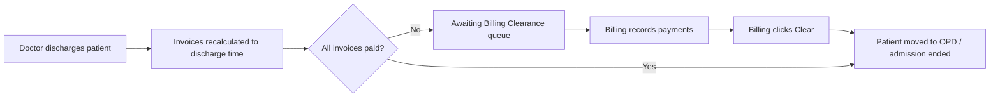

# Inpatient Billing Clearance Discharge API

Frontend integration guide for the two-step inpatient discharge flow: **clinical discharge** (doctor) and **billing clearance** (billing unit).

## Overview

Previously, `PATCH /admissions/:id` with a discharge date was rejected when admission-linked invoices were unpaid. Doctors could not save a discharge note or free the bed.

The flow is now split:



| Stage | Who | Admission status | Patient on ward? |
|-------|-----|------------------|------------------|
| Admitted | — | `ACTIVE` | Yes (bed assigned) |
| Clinically discharged, bill outstanding | Doctor | `PENDING_BILLING_CLEARANCE` | No (bed freed; patient kept on inpatient ward record for billing context) |
| Billing cleared | Billing | `DISCHARGED` | No (patient moved to OPD) |
| Death | Doctor | `DECEASED` | No (immediate finalize; no billing queue) |

**Auto-finalize:** If all linked invoices are already `PAID` when the doctor discharges (non-death), the backend skips the billing queue and finalizes immediately (same as before, but without blocking when unpaid).

---

## Authentication

All endpoints require a valid staff JWT (`Authorization: Bearer <token>`).

---

## 1. Doctor clinical discharge

**Existing endpoint** — no URL change.

```
PATCH /admissions/:id
```

### Request body

| Field | Type | Required | Notes |
|-------|------|----------|-------|
| `dischargeDate` | ISO 8601 string | Yes | Clinical discharge timestamp |
| `outcome` | string | Yes when discharging | One of: `Duly Discharged`, `Discharged against Medical Advice`, `Referred out`, `Death` |
| `dischargeSummary` | string | No | Doctor's discharge note |

### Example

```json
{
  "dischargeDate": "2026-06-23T14:30:00.000Z",
  "outcome": "Duly Discharged",
  "dischargeSummary": "Patient stable. Continue medications at home. Follow up in 2 weeks."
}
```

### Response handling

Check `status` on the returned admission:

| `status` | UI action |
|----------|-----------|
| `PENDING_BILLING_CLEARANCE` | Show success toast: **Sent to billing clearance.** Patient no longer appears on active ward lists. |
| `DISCHARGED` | Show success toast: **Patient discharged.** Bill was already settled; patient moved to OPD. |
| `DECEASED` | Show appropriate confirmation; no billing queue. |

### Errors

| HTTP | When |
|------|------|
| `400` | Missing `outcome`, invalid outcome, or admission is not `ACTIVE` |
| `404` | Admission not found |

---

## 2. Awaiting Billing Clearance list (billing screen)

**Screen title (recommended):** Awaiting Billing Clearance

```
GET /admissions/pending-billing-clearance?skip=0&take=20
```

### Query parameters

| Param | Default | Max |
|-------|---------|-----|
| `skip` | `0` | — |
| `take` | `20` | `100` |

### Example response

```json
{
  "admissions": [
    {
      "id": "a1b2c3d4-...",
      "admissionDate": "2026-06-18T08:00:00.000Z",
      "dischargeDateTime": "2026-06-23T14:30:00.000Z",
      "outcome": "Duly Discharged",
      "dischargeSummary": "Patient stable. Continue medications at home.",
      "room": "B-12",
      "wardEntity": { "id": "ward-uuid", "name": "Medical Ward" },
      "bed": null,
      "attendingDoctor": {
        "id": "doc-uuid",
        "firstName": "Jane",
        "lastName": "Okon",
        "staffId": "DOC-0042"
      },
      "clinicallyDischargedBy": {
        "id": "doc-uuid",
        "firstName": "Jane",
        "lastName": "Okon"
      },
      "patient": {
        "id": "pat-uuid",
        "patientId": "P-100234",
        "firstName": "Chidi",
        "surname": "Eze",
        "phoneNumber": "+2348012345678"
      },
      "billing": {
        "invoices": [
          {
            "id": "inv-uuid",
            "invoiceNumber": "INV-2026-004521",
            "status": "PARTIALLY_PAID",
            "totalAmount": "185000.00",
            "amountPaid": "120000.00",
            "balance": "65000.00"
          }
        ],
        "totalBalance": "65000.00",
        "allPaid": false
      }
    }
  ],
  "total": 1,
  "skip": 0,
  "take": 20
}
```

### Suggested table columns

1. Patient name / hospital ID (`patient.patientId`)
2. Ward (`wardEntity.name`)
3. Room / bed snapshot (`room` — bed is freed at clinical discharge)
4. Discharged at (`dischargeDateTime`)
5. Outcome
6. Attending doctor
7. Balance due (`billing.totalBalance`) — highlight when `> 0`
8. Actions: **View bill**, **Clear**

### Filter admissions list by status (optional)

```
GET /admissions?status=PENDING_BILLING_CLEARANCE&skip=0&take=20
```

Returns full admission records (same as general admissions list).

---

## 3. Collect payment (existing APIs)

No new payment endpoint. Use existing invoice payment APIs for each invoice in `billing.invoices`:

```
POST /invoices/:invoiceId/payments
```

After payment, **refresh** the pending list (or re-fetch the row) so `billing.allPaid` updates.

Wallet deposits (if needed):

```
POST /invoices/wallets/:patientId/deposits
```

---

## 4. Billing clearance (finalize discharge)

```
POST /admissions/:id/billing-clearance
```

No request body.

### Success (`200`)

Returns the finalized admission with `status: "DISCHARGED"`. Patient is moved to the OPD ward and `patient.status` becomes `OUTPATIENT`.

### Enable Clear button when

```ts
row.billing.allPaid === true
```

### Errors

| HTTP | Body | When |
|------|------|------|
| `400` | `{ message: "Cannot clear billing while linked invoices are unpaid...", billing: { ... } }` | Invoices still have balance |
| `400` | `{ message: "Admission is not awaiting billing clearance." }` | Wrong status (already cleared or still active) |
| `404` | — | Admission not found |

### Example error (unpaid)

```json
{
  "statusCode": 400,
  "message": "Cannot clear billing while linked invoices are unpaid. Record payments first.",
  "billing": {
    "invoices": [
      {
        "id": "inv-uuid",
        "invoiceNumber": "INV-2026-004521",
        "status": "PARTIALLY_PAID",
        "totalAmount": "185000.00",
        "amountPaid": "120000.00",
        "balance": "65000.00"
      }
    ],
    "totalBalance": "65000.00",
    "allPaid": false
  }
}
```

---

## 5. Admission status reference

| Status | Meaning |
|--------|---------|
| `ACTIVE` | Currently admitted; appears on ward census |
| `PENDING_BILLING_CLEARANCE` | Doctor discharged; awaiting billing clearance |
| `DISCHARGED` | Billing cleared (or auto-finalized when already paid); admission ended |
| `DECEASED` | Death outcome; finalized immediately |
| `TRANSFERRED` | Transferred to another facility/ward (unchanged) |

---

## 6. UI flows

### Doctor discharge form

1. Doctor fills outcome + discharge note + discharge date/time.
2. Submit `PATCH /admissions/:id`.
3. On `PENDING_BILLING_CLEARANCE`: inform doctor that billing will complete the process.
4. On `DISCHARGED`: patient is done (bill was already paid).

### Billing clearance desk

1. Load `GET /admissions/pending-billing-clearance`.
2. Row shows balance badge from `billing.totalBalance`.
3. User opens invoice(s) and records payment via existing invoice screens.
4. When `billing.allPaid` is true, enable **Clear**.
5. `POST /admissions/:id/billing-clearance` → remove row from queue.

### Ward / nursing views

Patients in `PENDING_BILLING_CLEARANCE` do **not** appear on active ward lists (`GET /admissions/active`, ward census). Nursing write actions are blocked for non-`ACTIVE` admissions.

---

## 7. Audit fields (optional display)

| Field | Set when |
|-------|----------|
| `dischargeSummary` | Doctor clinical discharge |
| `clinicallyDischargedBy` | Doctor clinical discharge |
| `billingClearedAt` / `billingClearedBy` | Billing clearance (or auto-finalize when already paid) |

These are included on `PATCH /admissions/:id` and `GET /admissions/:id` responses when populated.

---

## 8. Related endpoints

| Endpoint | Use |
|----------|-----|
| `GET /admissions/active` | Active inpatients only |
| `GET /admissions/:id` | Full admission detail including discharge note |
| `GET /admissions?status=DISCHARGED` | Historical discharged admissions |
| `POST /invoices/:id/payments` | Record payment before clearance |
