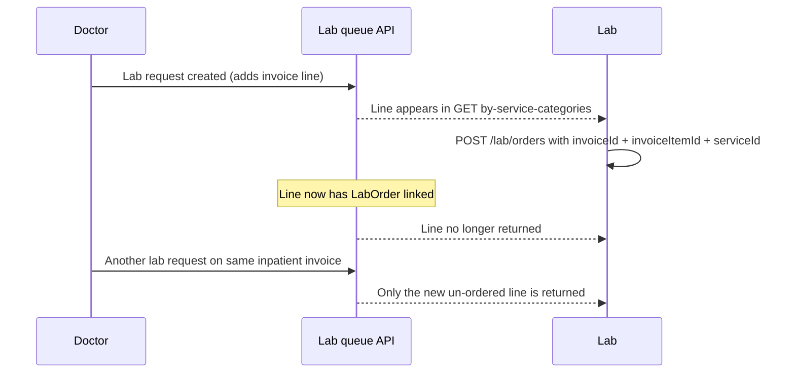

# Lab Invoice Queue — Frontend Integration Guide

## Summary

`GET /invoices/by-service-categories?category=Laboratory` is the lab billing/work queue. It now returns **only Laboratory invoice lines that do not yet have a lab order**.

Previously, every Laboratory line on a patient's open invoice was returned, including lines that had already been turned into lab orders and completed. That caused duplicate entries for inpatients when doctors submitted additional lab requests.

**You no longer need client-side deduplication** for this endpoint. The backend excludes consumed lines.

---

## Endpoint

```
GET /invoices/by-service-categories?category=Laboratory
```

### Query parameters

| Parameter | Required | Description |
|-----------|----------|-------------|
| `category` | Yes | Repeat or comma-separate. Use `Laboratory` or `Laboratory Tests` (case-insensitive). |
| `status` | No | Filter by invoice status: `PENDING`, `PARTIALLY_PAID`, `PAID`. |
| `fromDate` / `toDate` | No | Filter by invoice `updatedAt` range. |
| `search` | No | Broad search (invoice ID, patient name, payment reference). |
| `patientName` | No | Patient first/last name substring. |
| `invoiceId` / `invoiceID` | No | Human invoice number or UUID. |
| `skip` / `take` | No | Pagination (default `skip=0`, `take=20`). |

### Laboratory filtering rule

When the requested category is **Laboratory** or **Laboratory Tests**:

- An invoice line is included only if `InvoiceItem.labOrder` is **null** (no lab order linked yet).
- Lines that already have a `LabOrder` (pending, in progress, or completed) are **excluded**.
- If every Laboratory line on an invoice has been ordered, that invoice **does not appear** in the results.

Other categories (e.g. Pharmacy) are unaffected.

Mixed-category queries (e.g. `category=Laboratory&category=Pharmacy`) apply the lab-order exclusion **only** to Laboratory lines.

---

## Workflow



1. Doctor creates a lab request (`POST /lab-requests`) with a `serviceId` → a Laboratory invoice line is added.
2. Lab staff sees the patient/line in the queue via `GET /invoices/by-service-categories?category=Laboratory`.
3. Lab creates an order (`POST /lab/orders`) using the invoice line IDs from the response.
4. That line disappears from the queue on the next fetch.
5. If the doctor requests more labs later, only the **new** un-ordered line(s) appear — not historical ones.

---

## Inpatients

For actively admitted inpatients:

- Multiple lab requests on the same open invoice are normal (each request adds a separate line).
- Unpaid/pending invoice lines are valid for lab order creation (credit billing).
- After this change, the queue shows **only lines still awaiting a lab order**, not the full invoice history.

---

## Response shape

The response structure is **unchanged**. Only which rows are returned differs.

```json
{
  "total": 1,
  "skip": 0,
  "take": 20,
  "categories": ["Laboratory"],
  "rows": [
    {
      "patientName": "Jane Doe",
      "firstName": "Jane",
      "surname": "Doe",
      "phone": "+234...",
      "age": 42,
      "ward": "Medical Ward",
      "gender": "FEMALE",
      "date": "2026-07-07T12:00:00.000Z",
      "invoice": {
        "id": "uuid-invoice",
        "invoiceID": "INV0000123",
        "invoiceId": "INV0000123",
        "status": "PENDING",
        "patientId": "uuid-patient",
        "patient": {
          "id": "uuid-patient",
          "patientId": "HOS-001",
          "title": "Mrs",
          "firstName": "Jane",
          "otherName": null,
          "surname": "Doe"
        },
        "invoiceItems": [
          {
            "id": "uuid-invoice-item",
            "serviceId": "uuid-service",
            "service": {
              "id": "uuid-service",
              "name": "Full Blood Count",
              "category": {
                "id": "uuid-category",
                "name": "Laboratory"
              }
            },
            "quantity": 1,
            "unitPrice": "2500.00",
            "amountPaid": "0.00",
            "customDescription": null,
            "requestingDoctor": "Dr. Smith",
            "createdBy": {
              "id": "uuid-staff",
              "firstName": "John",
              "lastName": "Smith"
            }
          }
        ]
      }
    }
  ]
}
```

### IDs needed to create a lab order

From each `invoiceItems[]` entry, pass to `POST /lab/orders`:

| Field | Source |
|-------|--------|
| `invoiceId` | `row.invoice.id` |
| `invoiceItemId` | `row.invoice.invoiceItems[].id` |
| `serviceId` | `row.invoice.invoiceItems[].serviceId` |
| `patientId` | `row.invoice.patientId` |
| `doctorId` | Ordering doctor staff ID (from your session/context) |

---

## Frontend migration notes

1. **Remove duplicate filtering** — If the lab queue UI was hiding lines that already had orders (e.g. by tracking local state or cross-referencing `/lab/orders`), that logic is no longer required for this endpoint.
2. **Empty state** — An invoice vanishing from the list means all its Laboratory lines have been ordered; this is expected.
3. **Re-fetch after order creation** — After a successful `POST /lab/orders`, refresh the queue; the consumed line should be gone.
4. **Multiple lines per invoice** — A single `rows[]` entry may still contain multiple `invoiceItems` when several un-ordered lab requests exist on the same invoice. Each item is a separate actionable row in the UI.
5. **Category aliases** — Both `Laboratory` and `Laboratory Tests` are valid category names and receive the same pending-only filter.

---

## Related endpoints

| Endpoint | Purpose |
|----------|---------|
| `POST /lab-requests` | Doctor creates a lab request (optionally bills via `serviceId`). |
| `POST /lab/orders` | Lab creates an order from a queued invoice line. |
| `GET /lab/investigations` | Alternative lab work queue (filters `labRequest` where `invoiceItem.labOrder` is null). |

The invoice queue and lab investigations queue now follow the same rule: **do not show work that already has a lab order**.
