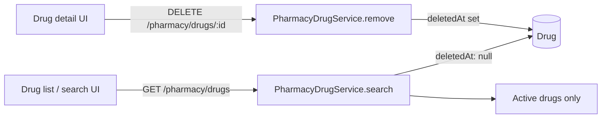

# Pharmacy Drug Hide / Delete — Frontend Integration Guide

Backend API for **hiding** (soft-deleting) pharmacy catalog drugs. Hidden drugs are excluded from all drug search/list responses. This is not a hard delete — historical prescriptions, invoices, and batch records are preserved.

**Swagger:** `GET /api` (tagged *Pharmacy - Drugs*)

---

## Overview

| Concept | Behavior |
|---------|----------|
| Hide drug | Sets `Drug.deletedAt` to the current timestamp |
| Search / list | `GET /pharmacy/drugs` returns only drugs where `deletedAt` is null |
| Detail | `GET /pharmacy/drugs/:id` returns `404` for hidden drugs |
| Stock guard | Hide is **blocked** while **sellable** stock remains on hand |



### What “sellable stock” means

The backend uses the same rules as drug search quantity:

- Batch `quantityRemaining` > 0
- Batch not expired (`expiryDate` ≥ start of today)
- Batch not in excluded locations (*sold stock*, *damaged stock*)

If sellable quantity > 0, hide returns **400 Bad Request**.

---

## Base URL & authentication

| Setting | Value |
|---------|-------|
| Base URL | No global prefix (e.g. `http://localhost:4000`) |
| Auth header | `Authorization: Bearer <JWT>` on every route |
| JWT `sub` | Staff ID recorded as `updatedById` on hide |

---

## API: hide a drug

### `DELETE /pharmacy/drugs/:id`

Soft-hides a drug from the active catalog.

**Path parameters**

| Name | Type | Description |
|------|------|-------------|
| `id` | UUID | Drug ID |

**Success — `200 OK`**

Returns the updated drug row, including `deletedAt`:

```json
{
  "id": "550e8400-e29b-41d4-a716-446655440000",
  "genericName": "Paracetamol",
  "brandName": "Panadol",
  "searviceCode": "PHAR123456",
  "deletedAt": "2026-06-14T10:30:00.000Z",
  "updatedAt": "2026-06-14T10:30:00.000Z",
  "updatedById": "staff-uuid"
}
```

**Errors**

| Status | When | Typical `message` |
|--------|------|-------------------|
| `400` | Sellable stock still on hand | `Cannot hide drug while sellable stock remains. Deplete or transfer stock first.` |
| `404` | Drug not found or already hidden | `Drug "<id>" not found.` |
| `401` | Missing or invalid JWT | Unauthorized |
| `403` | Access denied | Forbidden |

---

## Search behavior (important for frontend)

- Use **`GET /pharmacy/drugs`** for all drug pickers, autocomplete, and pharmacy catalog lists.
- The backend already filters `deletedAt: null` — **do not** add a client-side `deletedAt` filter when using this endpoint.
- Hidden drugs **cannot** appear in search results, filter results, or cursor-paginated pages.
- After a successful hide:
  - Remove the row from local list state, **or**
  - Refetch the current search page, **or**
  - Navigate back to the drug list.

### Detail view after hide

If the user hides from a detail screen, navigate away (e.g. back to list). A subsequent `GET /pharmacy/drugs/:id` for that ID will return **404**.

---

## UI recommendations

### Button placement

| Screen | Recommendation |
|--------|----------------|
| Pharmacy drug **detail** | Primary — destructive action in header or overflow menu |
| Pharmacy drug **list / table** | Optional row action (icon or menu item) |
| Prescription / invoice drug pickers | **Do not** add hide here — pickers should only list active drugs via search |

### Labeling & confirmation

Use **“Hide drug”** or **“Remove from catalog”** — not “Delete permanently”.

Suggested confirmation copy:

> Hide **{brandName}** ({genericName}) from the pharmacy catalog?
>
> - The drug will no longer appear in searches or new orders.
> - Past prescriptions and invoices are not affected.
> - You cannot hide a drug while sellable stock remains.

### Pre-check (optional UX)

Search and detail responses include a computed **`quantity`** field (sellable stock). You may:

- Disable the hide button when `quantity > 0`, with helper text: *“Deplete or transfer stock before hiding.”*
- Still handle **400** from the API if the user attempts hide anyway (stock may change between page load and action).

### After success

- Show a success toast: *“Drug hidden from catalog.”*
- Remove from list or navigate to the drug list.

---

## Example integration

### TypeScript / fetch

```typescript
const API_BASE = 'http://localhost:4000';

async function hidePharmacyDrug(
  drugId: string,
  token: string,
): Promise<void> {
  const res = await fetch(`${API_BASE}/pharmacy/drugs/${drugId}`, {
    method: 'DELETE',
    headers: {
      Authorization: `Bearer ${token}`,
    },
  });

  if (!res.ok) {
    const body = (await res.json().catch(() => ({}))) as {
      message?: string | string[];
    };
    const message = Array.isArray(body.message)
      ? body.message.join(', ')
      : body.message ?? `Hide failed (${res.status})`;
    throw new Error(message);
  }
}
```

### React-style handler (illustrative)

```typescript
async function onConfirmHide(drug: { id: string; quantity?: number }) {
  if ((drug.quantity ?? 0) > 0) {
    toast.error('Deplete or transfer stock before hiding this drug.');
    return;
  }

  try {
    await hidePharmacyDrug(drug.id, authToken);
    toast.success('Drug hidden from catalog.');
    navigate('/pharmacy/drugs');
  } catch (err) {
    toast.error(err instanceof Error ? err.message : 'Could not hide drug.');
  }
}
```

---

## Related endpoints (unchanged)

| Method | Path | Purpose |
|--------|------|---------|
| `GET` | `/pharmacy/drugs` | Search / list active drugs |
| `GET` | `/pharmacy/drugs/:id` | Get active drug detail |
| `POST` | `/pharmacy/drugs` | Create drug |
| `PATCH` | `/pharmacy/drugs/:id` | Update active drug |

There is **no restore / unhide** endpoint at this time. Hidden drugs remain in the database for audit and historical links only.

---

## Test checklist

- [ ] Hide button visible on pharmacy drug detail (and optionally list row menu)
- [ ] Confirmation dialog shown before API call
- [ ] Hide succeeds when `quantity === 0`; drug disappears from list/search
- [ ] Hide blocked with clear message when `quantity > 0` (UI disable and/or API 400)
- [ ] Already-hidden or invalid ID shows error (404)
- [ ] Unauthenticated request returns 401
